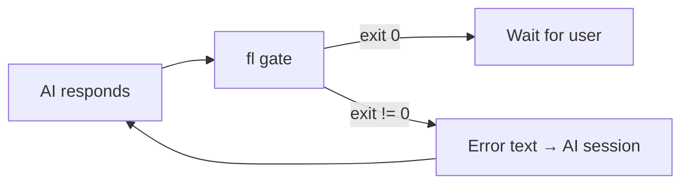

# ForceLoop (`fl`)

**A structured development workflow CLI.**  
ForceLoop imposes a lightweight pipeline — New → Plan → Audit → Implement → Review → Done — and uses platform hooks to automatically gate each phase. When a gate fails, the error is fed back to the AI, creating an autonomous fix loop.

[![Crates.io][crates-badge]](https://crates.io/crates/forceloop)
[![npm][npm-badge]](https://www.npmjs.com/package/@forceloop/cli)
[![MIT licensed][mit-badge]](LICENSE)

[crates-badge]: https://img.shields.io/crates/v/forceloop
[npm-badge]: https://img.shields.io/npm/v/@forceloop/cli
[mit-badge]: https://img.shields.io/badge/license-MIT-blue

---

## Table of Contents

- [Installation](#installation)
- [Quick Start](#quick-start)
- [The Pipeline](#the-pipeline)
- [Commands](#commands)
- [Platform Setup](#platform-setup)
- [Hooks (Auto-Fix Loop)](#hooks-auto-fix-loop)
- [Design Philosophy](#design-philosophy)
- [Architecture](#architecture)
- [Development](#development)

---

## Installation

### From npm (no Rust toolchain required)

```bash
npm install -g @forceloop/cli
```

Or run directly without installing:

```bash
npx @forceloop/cli setup --help
```

### From crates.io (requires Rust toolchain)

```bash
cargo install forceloop
```

### From source

```bash
git clone <repo>
cd forceloop
cargo install --path .
```

Or build locally:

```bash
cargo build --release
# binary at ./target/release/fl
```

### Prerequisites

- Rust 2024 edition or later
- For Claude Code integration: [Claude Code CLI](https://code.claude.com)
- For oh-my-pi integration: oh-my-pi with Bun runtime
- For OpenCode integration: [sst/opencode](https://opencode.ai)

### Available platforms

`fl setup` installs to all **three** platforms by default:

| `--tool` | Platform | Command files | Hook |
|----------|----------|---------------|------|
| `claude` | Claude Code | `.claude/commands/fl-*.md` | `.claude/settings.json` (`Stop` event) + `.claude/hooks/fl-gate.sh` |
| `opencode` | OpenCode | `.opencode/command/fl-*.md` | `.opencode/plugins/fl.ts` (`session.idle` event) |
| `omp` | oh-my-pi | `.omp/commands/fl-*.md` | `.omp/hooks/pre/fl-gate.ts` (`session_stop` event) |

### Per-platform setup

```bash
# Install to all platforms (default)
fl setup

# Install to specific platforms only
fl setup --tool claude
fl setup --tool opencode
fl setup --tool omp

# Install to multiple (explicit)
fl setup --tool claude --tool opencode
```

---

## Quick Start

```bash
# 1. Initialize a project
cd your-project
fl setup

# 2. Start the pipeline — create design specs
#    (the AI runs this via the /fl-new skill)
fl new

# 3. Create a multi-wave development plan
fl plan

# 4. Audit specs against plans
fl audit

# 5. Implement wave by wave (TDD)
fl implement

# 6. Review the implementation
fl review

# 7. Archive completed work
fl archive
```

After `fl setup`, every AI response triggers `fl gate` automatically.  
When a gate fails, the AI sees the error and self-corrects.

---

## The Pipeline

ForceLoop defines a linear 6-phase pipeline:

```
New → Plan → Audit → Implement → Review → Done
```

State is persisted in `.forceloop/state.json`. Each boolean flag represents
whether the corresponding gate has passed. Gates are checked in order and
are idempotent — re-running a passed gate is a no-op.

| Phase | Gate checks | Artifact |
|-------|-------------|----------|
| **New** | `specs/index.md` exists, wiki links resolve | `.forceloop/specs/` |
| **Plan** | `plans/index.md` exists, wiki links resolve; auto-generates `wave_state.md` | `.forceloop/plans/` |
| **Audit** | `audit.md` exists, all checklist items `[x]` | `.forceloop/audit.md` |
| **Implement** | `wave_state.md` exists, all waves completed, all waves accounted for | `.forceloop/wave_state.md` |
| **Review** | `review_result.md` exists, all checklist items `[x]` | `.forceloop/review_result.md` |
| **Done** | All prior gates passed | — |

---

## Commands

### Top-level subcommands

| Command | Description |
|---------|-------------|
| `fl setup` | Initialize `.forceloop/` directory, write command files and hooks to all platforms |
| `fl gate` | Read pipeline state, find first unpassed gate, validate, advance state |
| `fl status` | View current pipeline state |
| `fl archive` | Archive `specs/`, `plans/`, all `.json`/`.md` files to `archive_<timestamp>.tar.gz`, then clean up |

### Skill / custom commands

These are registered as slash commands on each platform and invoked by the AI:

| Command | Slash | Purpose |
|---------|-------|---------|
| `fl new` | `/fl-new` | Create specs directory scaffold |
| `fl plan` | `/fl-plan` | Create plans directory scaffold |
| `fl audit` | `/fl-audit` | Verify specs and plans are consistent |
| `fl implement` | `/fl-implement` | Execute TDD wave by wave |
| `fl review` | `/fl-review` | 7-dimension regression cross-verification |

### Gate error messages

When a gate blocks, the error message is phase-specific so the AI knows
exactly what to fix:

| Phase | Error |
|-------|-------|
| New | "Spec generation verification failed. Review the files under specs/ directory and regenerate if needed." |
| Plan | "Plan generation incomplete. Cross-review the files under specs/ and plans/ directories." |
| Audit | "Audit report incomplete. Re-run the audit." |
| Implement | "Implementation verification failed: N wave(s) not yet completed. Re-run the current wave's development tasks." |
| Review | "Code review report verification failed. Re-run the review." |

---

## Platform Setup

`fl setup` installs 5 command files plus platform-specific hooks to each target.
By default it installs to **all three** platforms.

### Output directories

| `--tool` | Directory | Command files | Hook |
|----------|-----------|---------------|------|
| `claude` | `.claude/commands/` | `fl-new.md`, `fl-plan.md`, etc. (5) | `.claude/hooks/fl-gate.sh` + `settings.json` merge |
| `opencode` | `.opencode/command/` | `fl-new.md`, `fl-plan.md`, etc. (5) | `.opencode/plugins/fl.ts` (auto-loaded) |
| `omp` | `.omp/commands/` | `fl-new.md`, `fl-plan.md`, etc. (5) | `.omp/hooks/pre/fl-gate.ts` |

Claude Code commands use native YAML frontmatter with `allowed-tools` and `argument-hint`.
OpenCode and omp share a YAML format that drops `allowed-tools` (using `agent` delegation instead).

---

## Hooks (Auto-Fix Loop)

All three platforms are wired to automatically run `fl gate` after every
AI response. When the gate fails, its error output is injected back into
the session as a new prompt, creating an autonomous fix loop.



### Claude Code (`Stop`)

- **Event**: `Stop` — fires after each response
- **Hook**: `.claude/hooks/fl-gate.sh` (shell script, embedded from [plugin/claude-hook.sh](plugin/claude-hook.sh))
- **Exit 2**: blocking error — stderr fed to Claude as error message
- **Auto-fix**: Claude sees the gate error and self-corrects

The wrapper script converts `fl gate`'s exit code 1 into exit code 2,
which Claude Code treats as a blocking error (the only way to feed
stderr back to the AI). Merged into `.claude/settings.json` by `fl setup`.

```json
{
  "hooks": {
    "Stop": [{
      "hooks": [{
        "type": "command",
        "command": "${CLAUDE_PROJECT_DIR}/.claude/hooks/fl-gate.sh",
        "timeout": 60
      }]
    }]
  }
}
```

### OpenCode (`session.idle`)

- **Event**: `session.idle` — fires when the session is idle
- **Plugin**: `.opencode/plugins/fl.ts` (TypeScript, Bun Shell, embedded from [plugin/fl.ts](plugin/fl.ts))
- **Auto-loaded**: OpenCode auto-loads `.ts` files from `.opencode/plugins/` — no config registration needed
- **Non-zero exit**: captured stdout+stderr sent via `client.session.prompt({ noReply: false })`
- **Structure**: `export const FlGateHook: Plugin = async ({ client, $ }) => { ... }`

### oh-my-pi (`session_stop`)

- **Event**: `session_stop` — fires after each agent response
- **Hook**: `.omp/hooks/pre/fl-gate.ts` (TypeScript, embedded from [plugin/omp-fl-gate.ts](plugin/omp-fl-gate.ts))
- **Continuation**: returns `{ continue: true, additionalContext }` to
  inject gate output as a new user message
- **Limit**: omp enforces a maximum of 8 consecutive continuations per session

---

## Design Philosophy

### 1. Gate-driven autonomy

The pipeline is driven by **gates**, not by manual steps. Each gate
validates that its phase's artifact is complete and correct. This means
the AI can run autonomously through the entire workflow — it writes
code, runs tests, and the gate confirms whether it's done or needs to
fix something.

### 2. Phase-specific failure feedback

Generic error messages ("something failed") are useless for autonomous
agents. Every gate error includes:

- **Which phase** failed
- **What artifact** is missing or incomplete
- **What action** to take (re-run, re-review, regenerate)

This lets the AI self-correct without human intervention.

### 3. No magic, just files

Everything is a file on disk:
- Pipeline state → `.forceloop/state.json`
- Artifacts → `.md` files with wiki links and checklists
- Hooks → platform-native config files (TypeScript, shell, JSON)

There is no database, no daemon, no server. You can inspect, debug, and
manually edit every piece of state with standard tools.

### 4. Skeleton-first, TDD

New features start as trait definitions + `todo!()` stubs, then are
filled in iteratively. Tests come before production code (TDD).
This prevents the codebase from accumulating half-baked features.

### 5. Minimal dependencies

The binary has only 7 runtime dependencies. Features like wiki-link
validation are hand-rolled rather than pulling in `regex` or `dirs`.
New dependencies are added only when the cost of hand-rolling exceeds
the cost of the dependency. (Current deps: `clap`, `anyhow`, `thiserror`,
`serde`, `serde_json`, `flate2`, `tar`.)

---

## Architecture

```
main → cli → {commands/, setup, gate, status, archive}
                 ↓
   {context, errors, traits, schema, compiler, state}
                 ↓
          {constants, utils}
```

### Module layers

| Layer | Modules | Role |
|-------|---------|------|
| **CLI** | `cli.rs`, `main.rs` | Argument parsing, dispatch |
| **Commands** | `commands/*.rs` | 5 skill/command objects (New, Plan, Audit, Implement, Review) implementing `CommandMetadata` |
| **Subcommands** | `setup.rs`, `gate.rs`, `status.rs`, `archive.rs` | 4 terminal CLI subcommands implementing `Subcommand` |
| **Core** | `context.rs`, `errors.rs`, `traits.rs`, `schema.rs`, `compiler.rs`, `state.rs` | Shared types, traits, compilation, pipeline state with artifact/checklist verification |
| **Leaf** | `constants.rs`, `utils.rs` | Must not import other crate modules |

### Key traits

- **`Executable`** — all 9 command objects implement this.
  Single method: `execute(&self, ctx: &Context) -> Result<()>`
- **`Subcommand: Executable`** — the 4 top-level subcommands.
  Adds `name()` and `description()` for clap help
- **`CommandMetadata`** — the 5 skill/command structs.
  Adds `skill_template()`, `command_template()`, `artifacts()`, `gate()`, `check_list()`

### Pipeline state machine

```rust
struct PipelineState {
    new: bool,
    plan: bool,
    audit: bool,
    implement: bool,
    review: bool,
    done: bool,
}
```

JSON-persisted at `.forceloop/state.json`. Each boolean is `true` when
the corresponding gate has passed. State files are made **read-only** on
disk after each write to prevent LLM tools from corrupting pipeline state.

The read_or_default() method auto-migrates from the legacy
`{"current_phase":"..."}` format to the current boolean-flag format.

---

## Development

```bash
# Quick compile check
cargo check

# Build
cargo build

# Run all tests (unit + integration)
cargo test

# Lint
cargo clippy --all-targets

# Help
cargo run -- --help
cargo run -- setup --help
```

### Test files

| File | Tests |
|------|-------|
| `tests/cli_help.rs` | CLI argument parsing and help output (7 tests) |
| `tests/command_compile.rs` | Schema compilation and agent compilation for all platforms (11 tests) |
| `tests/setup_tool.rs` | Setup with all target combinations, file output, hook generation, migration (21 tests) |
| `src/*.rs` | Unit tests across all modules (75+ tests) |
| **Total** | **114 tests** |

### Conventions

- **Skeleton-first**: define trait/struct/fn signature with `todo!()`,
  then fill in implementation iteratively
- **Tests-first (TDD)**: new modules define tests before production code
- **No reverse module imports**: `utils.rs` and `constants.rs` are leaves;
  importing other crate modules from them is a design smell
- **No `unwrap()` in production code**: use `Result` with `thiserror`
- **Compile-time embedding**: TypeScript/shell sources in `plugin/` are
  embedded via `include_str!` — edit the source file, rebuild picks up changes

---

## License

MIT